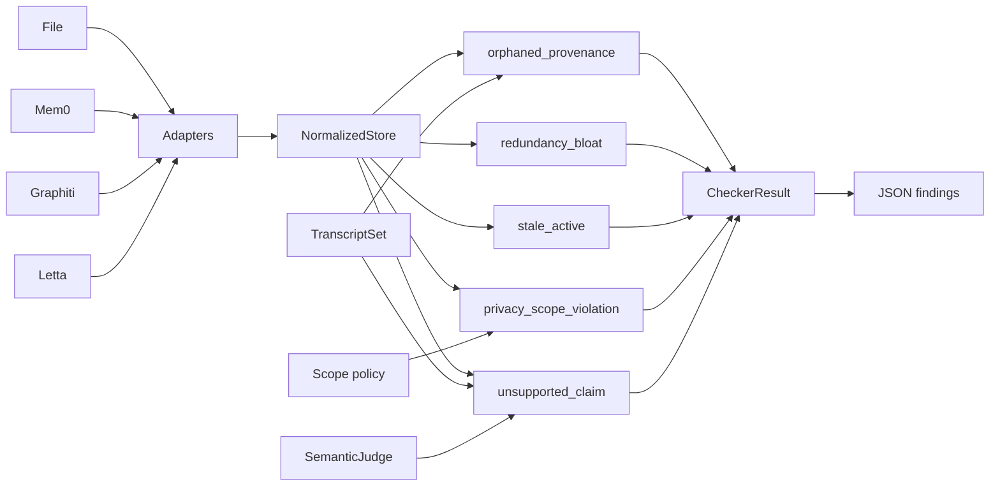
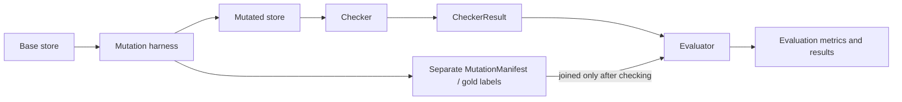

# MemLint

MemLint is a provenance-aware auditing toolkit for LLM agent memory stores. It normalizes memory
exports, runs structural and evidence-based checks, creates controlled mutations for evaluation,
and audits recorded retrieval observations without requiring hidden canonical user state.

## Architecture



## How it works

1. Load a memory export through the File, Mem0, Graphiti, or Letta adapter.
2. Normalize backend records into a `NormalizedStore`. Backend-specific fields remain under `raw`.
3. Select a checker and supply its required evidence, such as transcripts, a scope policy, or a
   semantic judge.
4. Run the checker over normalized fields and its declared supporting inputs.
5. Receive a deterministic `CheckerResult`, which can be serialized as JSON.

See [checker behavior](docs/checkers.md) for the checker-specific requirements.

## Features

- A backend-independent normalized memory schema with deterministic JSON serialization.
- File, Mem0, Graphiti, and Letta adapters.
- Five public audit checkers for provenance, duplication, supersession, scope, and support.
- Controlled mutation manifests kept separate from detector input.
- Retrieval sufficiency and paired shadowing assessment for recorded observations.
- An optional local CPU MiniLM semantic judge.
- Reproducible synthetic evaluation fixtures and runners.

## Installation

MemLint requires Python 3.11 or newer.

```bash
python -m pip install -e .
```

Install optional backend support as needed:

```bash
python -m pip install -e '.[mem0]'
python -m pip install -e '.[graphiti]'
python -m pip install -e '.[letta]'
```

The bundled local semantic judge is separate from the core install:

```bash
python -m pip install -e '.[semantic-local]'
```

## Quick start

Normalize a file-backed memory store:

```bash
memlint dump \
  --adapter file \
  --source examples/store.yaml \
  --output normalized.json
```

Run a structural audit:

```bash
memlint audit \
  --store normalized.json \
  --transcripts examples/transcripts.json \
  --checker orphaned_provenance \
  --output findings.json
```

Create a controlled mutation and a separate gold manifest:

```bash
memlint mutate \
  --store examples/mutation-store.json \
  --transcripts examples/mutation-transcripts.json \
  --defect unsupported_claim \
  --target-id preference-python \
  --replace-from Python \
  --replace-to Rust \
  --output mutated.json \
  --manifest mutation.json
```

Project a recorded retrieval observation into a checker result:

```bash
memlint retrieval-audit \
  --observation retrieval-observation.json \
  --policy all_expected \
  --output retrieval-findings.json
```

## Checkers

| Checker | Detects | Extra input |
|---|---|---|
| `orphaned_provenance` | Declared transcript references that cannot be resolved | `TranscriptSet` |
| `redundancy_bloat` | Exact duplicate memories in the same scope | None |
| `stale_active` | Explicitly superseded memories that remain active | None |
| `privacy_scope_violation` | Policy-prohibited exact replicas across user or agent boundaries | Scope policy |
| `unsupported_claim` | Claims not entailed by their declared transcript evidence | `TranscriptSet` and semantic judge |

`unsupported_claim` requires transcript evidence. The CLI implementation also requires the optional
local semantic dependency plus an explicit model ID and revision when using the bundled MiniLM
judge. The identity-grounded semantic candidate is experimental and is not a public/default checker.

See [checker behavior](docs/checkers.md), [semantic evidence](docs/semantics.md), and the
[defect taxonomy](docs/taxonomy.md) for the detailed contracts.

## Supported inputs

The file adapter accepts JSON, JSONL, YAML, and one-memory Markdown files with YAML front matter.
Mem0, Graphiti, and Letta exports can be loaded through optional adapters. Backend-specific fields
remain under `raw`; generic checks use normalized fields only. Missing timestamps, embeddings, or
provenance remain explicitly unavailable rather than being inferred.

## Evaluation

MemLint includes gold-safe controlled-mutation accounting and reproducible synthetic probes. The
results are controlled evidence, not estimates of production accuracy or defect prevalence. They
include supported, negative, and inconclusive findings.

| Area | Current evidence |
|---|---|
| Structural checkers | Supported on the controlled synthetic benchmark |
| Unsupported claim | Detects controlled substitutions; the plain representation has identity-sensitive clean failures |
| Identity grounding | Supported as an optional experimental candidate |
| Broad retrieval shadowing | Tested hypothesis not supported |
| Negation-specific retrieval | Tested hypothesis not supported |
| Confidence abstention | Inconclusive under the current synthetic probe |
| Internal contradiction | Deferred |
| Injected instruction | Deferred |

See [evaluation results](docs/results.md) for the full experiments, counts, and limitations.

The controlled static evaluation keeps mutation labels separate from checker input:



The checker never receives the gold manifest. Retrieval-shadowing challenges instead require paired
recorded retrieval observations; see [retrieval auditing](docs/retrieval.md).

## Limitations

- MemLint does not ship a production/live backend retriever.
- Retrieval shadowing can be projected from recorded observations but is not automatically scanned.
- The identity-grounded unsupported-claim candidate is optional and nondefault; current adapters do
  not automatically supply trusted human-readable speaker bindings.
- `internal_contradiction` and `injected_instruction` detectors remain deferred.
- Semantic conclusions depend on the evidence and context supplied to the audit.
- MemLint does not perform automatic repair or generate embeddings.

## Documentation

- [Checker behavior](docs/checkers.md)
- [Evaluation methodology](docs/evaluation.md)
- [Evaluation results](docs/results.md)
- [Retrieval auditing](docs/retrieval.md)
- [Semantic evidence](docs/semantics.md)
- [Mutation harness](docs/mutations.md)
- [Defect taxonomy](docs/taxonomy.md)
- [Speaker identity integration](docs/speaker_identity_integrations.md)

## Development

```bash
pytest
ruff check .
mypy src/memlint
```

## License

MIT
